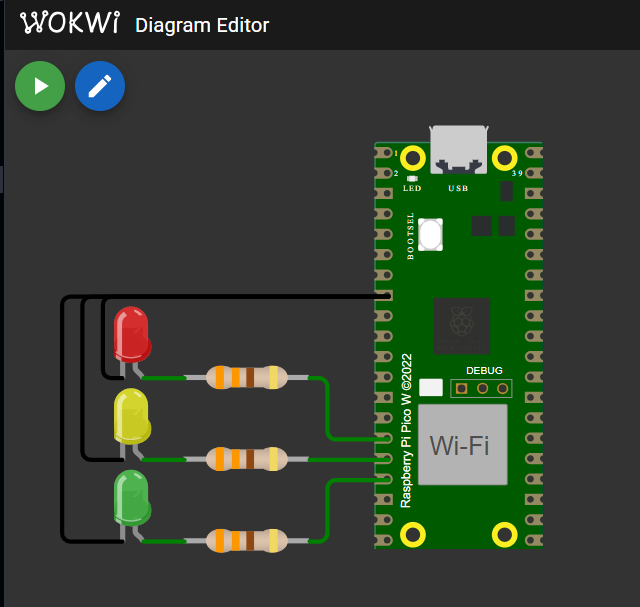
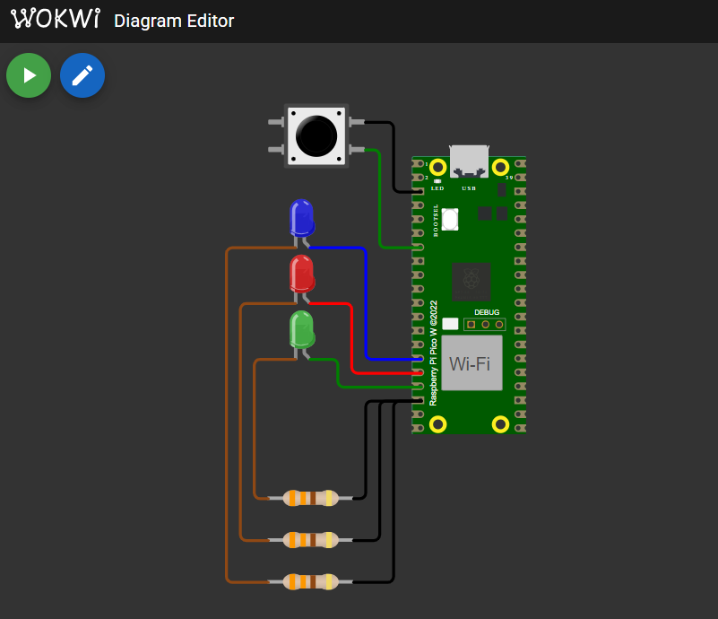

# Atividade 01: Temporizador periódico.

## Funcionalidade

1) O acionamento dos LEDs (sinais do semáforo) deve iniciar na cor vermelha, alterando para amarela e, em seguida, verde.
2) O temporizador deve ser ajustado para um atraso de 3 segundos (3.000ms).
3) A mudança de estado dos LEDs foi implementada utilizando o recurso repeating_timer_callback()
4) A rotina principal, presente no interior da estrutura de repetição while, imprime "1 segundo se passou em loop" a cada segundo (1.000 ms) 

## Modelo Wokwi

## Funcionamento do projeto 1

# Atividade 02: Temporizador de um disparo (One Shot).

## Funcionalidade

1) Caso o usuário clique no botão (pushbutton), os três LEDs serão ligados (todos em nível alto). A partir da primeira rotina de atraso, ocorrerá uma mudança de estado para dois LEDs ligados e, em seguida, apenas um.
2) O temporizador do alarme esta ajustado para um atraso de 3 segundos (3.000ms), entre os estados de acionamento dos LEDs.
3) A mudança de estado dos LEDs foi implementada utilizando o recurso turn_off_callback().
4) O botão só pode alterar o estado dos LEDs quando o último LED for desligado. Deste modo, durante a execução das rotinas de temporização, o botão não pode iniciar uma nova chamada da função call-back.

## Modelo Wokwi

## Funcionamento do projeto 2

